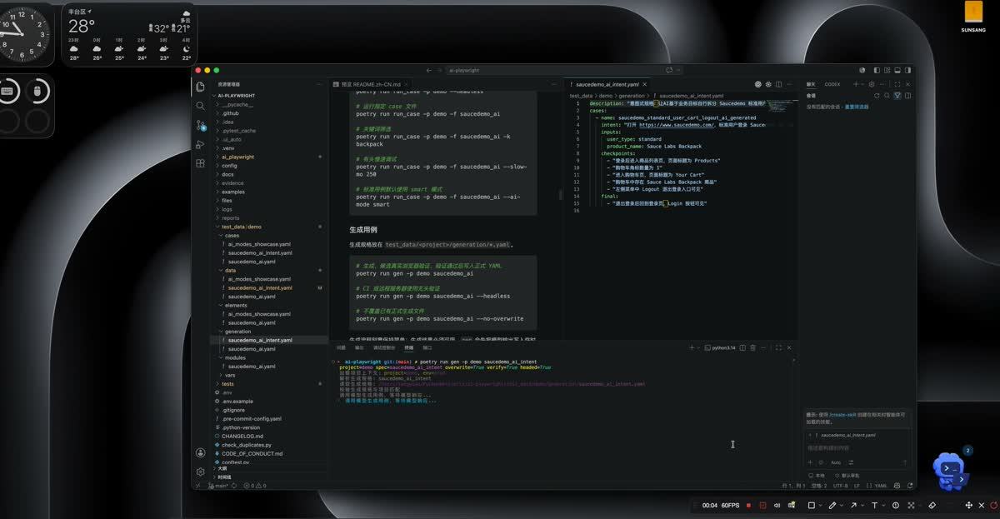
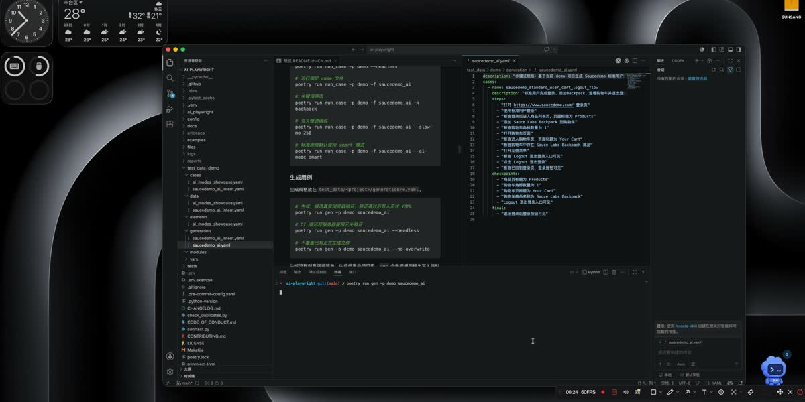

# AI Playwright

[](https://github.com/liyanqing90/ai-playwright-framework/actions/workflows/ci.yml)
[](https://www.python.org/)
[](LICENSE)

[English](README.md) | 简体中文

AI Playwright 是一个基于 Playwright 和 pytest 的 YAML 驱动 UI 自动化框架。它把可审查、可版本化、可重复执行的测试资产作为核心，同时提供 AI 辅助用例生成、智能 selector 恢复，以及面向自然语言意图的运行时 agent 能力。

当前项目处于 alpha 阶段。公开 API、YAML 契约和 AI 运行时行为仍可能演进，但仓库已经包含契约测试、YAML schema 校验、打包检查和 GitHub Actions CI 门禁。

## 目录

- [为什么需要 AI Playwright](#为什么需要-ai-playwright)
- [能力概览](#能力概览)
- [演示](#演示)
- [快速开始](#快速开始)
- [安装](#安装)
- [核心概念](#核心概念)
- [使用方式](#使用方式)
- [配置](#配置)
- [AI 数据边界](#ai-数据边界)
- [项目结构](#项目结构)
- [开发](#开发)
- [贡献](#贡献)
- [安全](#安全)
- [排查问题](#排查问题)

## 为什么需要 AI Playwright

UI 自动化通常会同时遇到两类需求：

- 稳定测试必须确定、可审查、无需模型也能运行。
- 快速变化的页面又需要更高效地生成 YAML、修复 selector、或用自然语言表达探索性流程。

AI Playwright 将这两件事分离：

- `cases/`、`data/`、`elements/`、`modules/`、`vars/` 是测试资产的唯一事实来源。
- `strict` 模式只执行显式 YAML，不调用模型。
- `smart` 模式保持 action 不变，只在当前步骤意图内恢复 selector。
- `agent_case` 可在运行时执行自然语言步骤或目标，但仍走统一的 StepExecutor 命令管线。
- `gen` 从自然语言规格生成正式 YAML，并且必须通过真实浏览器验证后才写入。

## 能力概览

- YAML-first UI 自动化，支持 pytest 动态收集。
- 基于 Playwright，支持 Chromium、Firefox、WebKit。
- 支持多项目、多环境配置。
- 支持公共模块、变量替换、条件分支和循环。
- 支持 AI 辅助用例生成。
- 支持基于证据的智能 selector 恢复。
- 支持 `agent_case` 运行时自然语言流程。
- 默认外部模型数据脱敏策略，避免直接泄露敏感 UI 文本。
- CI 覆盖格式检查、契约测试、YAML schema、重复定义、打包和安装后 CLI 冒烟检查。

## 演示

点击预览图打开 MP4 演示视频。

| Agent 意图执行 | AI 用例生成 |
|---|---|
| [](docs/assets/demo/agent-intent.mp4) | [](docs/assets/demo/agent-case-generation.mp4) |

## 快速开始

### 从源码运行

```bash
git clone https://github.com/liyanqing90/ai-playwright-framework.git
cd ai-playwright-framework

poetry install
poetry run playwright install chromium
cp .env.example .env

poetry run run_case -p demo -f saucedemo_ai --headless
```

本地调试时默认是有头模式，也可以显式使用慢速执行：

```bash
poetry run run_case -p demo -f saucedemo_ai --slow-mo 250
```

### 从包安装后初始化工作区

```bash
python -m pip install .
playwright install chromium

mkdir my-ai-playwright-workspace
cd my-ai-playwright-workspace
ai-playwright-init
cat > .env <<'EOF'
LLM_DATA_POLICY=external
BASE_URL=https://www.saucedemo.com/
EOF

run_case -p demo -f saucedemo_ai --headless
```

`ai-playwright-init` 会复制安全的 `config/` 和 `test_data/demo/` 起始模板。源码仓库已经包含这些文件，开发源码时通常不需要执行初始化。

## 安装

### 环境要求

- Python `>=3.12,<3.15`
- Poetry，用于仓库开发
- Playwright 浏览器二进制

### 开发安装

```bash
poetry install
poetry run playwright install chromium
```

### 构建包

```bash
poetry build
python -m pip install dist/ai_playwright-*.whl
```

包内包含默认配置和 demo 测试数据模板，因此 CLI 可以在源码仓库外运行。

## 核心概念

### 测试资产分层

AI Playwright 在 `test_data/<project>/` 下组织 YAML 资产。

| 目录 | 作用 | 规则 |
|---|---|---|
| `cases/` | 测试顺序和名称 | 只声明 `test_cases[].name` |
| `data/` | 测试主体 | 存放 `description`、`mode`、`steps` 或 `type: agent_case` |
| `elements/` | 稳定元素 key | 把语义 key 映射到 selector |
| `modules/` | 可复用流程 | 存放登录等公共步骤 |
| `vars/` | 项目变量 | 存放 `${name}` 可引用的值 |
| `generation/` | AI 生成规格 | `gen` 的输入，不会被 pytest 收集 |

最小示例：

```yaml
# test_data/demo/cases/saucedemo_ai.yaml
test_cases:
  - name: test_saucedemo_backpack_cart
```

```yaml
# test_data/demo/data/saucedemo_ai.yaml
test_data:
  test_saucedemo_backpack_cart:
    description: 标准用户添加单个商品到购物车
    mode: smart
    steps:
      - use_module: saucedemo_login
        params:
          username: ${standard_username}
      - action: click
        selector: add_to_cart_backpack_btn
      - action: assert_text
        selector: shopping_cart_badge
        value: "1"
```

```yaml
# test_data/demo/elements/saucedemo_ai.yaml
elements:
  add_to_cart_backpack_btn: "[data-test='add-to-cart-sauce-labs-backpack']"
  shopping_cart_badge: .shopping_cart_badge
```

### 执行模式

| 模式或能力 | 使用位置 | 行为 |
|---|---|---|
| `strict` | 标准 YAML 步骤 | 只使用显式 selector，不调用模型、不做 selector 恢复 |
| `smart` | 标准 YAML 步骤 | action 固定，只恢复 selector 定位 |
| `ai_step` | 单个步骤 | 把一条自然语言指令编译成一个标准步骤 |
| `agent_case` | 整个用例 | 通过运行时规划执行自然语言步骤或目标 |
| `gen` | CLI 生成 | 生成正式 YAML，并强制真实浏览器验证 |

模式优先级：

1. 步骤级 `mode`。
2. 用例数据级 `data.<case>.mode`。
3. CLI `--ai-mode` 或 `UI_AI_MODE`。
4. `config/ai_config.yaml` 中的 `runtime.default_mode`。

`agent_case` 是独立用例类型，不应再声明 `mode`。

## 使用方式

### 运行测试

```bash
# 运行 demo 全部用例，默认有头
poetry run run_case -p demo

# 无头运行
poetry run run_case -p demo --headless

# 运行指定 case 文件
poetry run run_case -p demo -f saucedemo_ai

# 关键词筛选
poetry run run_case -p demo -f saucedemo_ai -k backpack

# 有头慢速调试
poetry run run_case -p demo -f saucedemo_ai --slow-mo 250

# 标准用例默认使用 smart 模式
poetry run run_case -p demo -f saucedemo_ai --ai-mode smart
```

### 生成用例

生成规格放在 `test_data/<project>/generation/*.yaml`。

```bash
# 生成、候选真实浏览器验证、验证通过后写入正式 YAML
poetry run gen -p demo saucedemo_ai

# CI 或远程服务器使用无头验证
poetry run gen -p demo saucedemo_ai --headless

# 不覆盖已有正式生成文件
poetry run gen -p demo saucedemo_ai --no-overwrite
```

生成流程刻意保持简单：生成结果必须可用。`gen` 会先把模型输出写入临时候选工作区，执行候选用例的真实浏览器验证；候选通过后，才写入正式 `cases/`、`data/`、`elements/`、`modules/` 或 `vars/` 文件，并再次执行写入后校验。验证默认有头，便于本地直接看到浏览器；没有可视化浏览器的环境再传 `--headless`。失败时会保留调试产物到 `logs/generation_runs/`。

示例生成规格：

```yaml
description: "Generate a Saucedemo cart flow"
cases:
  - name: saucedemo_standard_user_cart_logout_flow
    steps:
      - "Open https://www.saucedemo.com/"
      - "Log in as the standard user"
      - "Assert the product page title is Products"
      - "Add Sauce Labs Backpack to the cart"
      - "Assert the cart badge is 1"
      - "Open the cart page"
      - "Assert the cart contains Sauce Labs Backpack"
    final:
      - "The cart contains Sauce Labs Backpack"
```

### Smart Target 步骤

```yaml
- action: click
  target: "Sauce Labs Backpack add to cart button"
  mode: smart
```

这里 action 仍然是 `click`；只有 selector 解析可以被恢复。

### Agent Case

```yaml
test_data:
  test_saucedemo_agent_case_steps_cart_logout_flow:
    description: Runtime agent executes ordered natural-language steps
    type: agent_case
    steps:
      - "Open https://www.saucedemo.com/"
      - "Log in as the standard user"
      - "Add Sauce Labs Backpack to the cart"
      - "Open the cart page"
      - "Log out from the side menu"
    inputs:
      username: ${standard_username}
      password: ${common_password}
      product_name: Sauce Labs Backpack
    checkpoints:
      - "The cart badge is 1"
      - "The cart contains Sauce Labs Backpack"
    final:
      - "The login button is visible after logout"
```

`agent_case` 的运行策略由 `config/ai_config.yaml` 的 `agent_policy` 控制。单个用例应描述业务意图、输入、检查点和最终验收条件，不应写运行时限制或框架 guardrail。

### 报告和日志

运行产物会写入被 Git 忽略的目录：

- `reports/allure-results/`：Allure 结果。
- `logs/`：执行日志、token 使用、失败模型轨迹。
- `.ui_auto/`：selector registry 和 AI plan cache。

如果安装了 Allure CLI：

```bash
allure serve reports/allure-results
```

## 配置

### 环境变量

本地开发可从 `.env.example` 复制 `.env`。

```env
LLM_BASE_URL=http://localhost:4000/v1
LLM_API_KEY=
LLM_MODEL=
LLM_REASONING_EFFORT=medium
LLM_RESPONSE_FORMAT=auto
LLM_TIMEOUT_SECONDS=60
LLM_DATA_POLICY=external

BASE_URL=https://www.saucedemo.com/
```

关键字段：

| 变量 | 作用 |
|---|---|
| `LLM_BASE_URL` | OpenAI 兼容接口地址，provider 会追加 `/chat/completions` |
| `LLM_API_KEY` | 模型网关 API key，可为空 |
| `LLM_MODEL` | 模型名或 endpoint ID |
| `LLM_RESPONSE_FORMAT` | `auto`、`json_schema` 或 `text` |
| `LLM_DATA_POLICY` | 默认 `external`；只有可信本地或私有模型才使用 `trusted_local` |
| `BASE_URL` | 当前项目的 base URL 覆盖值 |

### 项目配置

`config/env_config.yaml` 定义项目、环境和浏览器默认配置。

```yaml
projects:
  demo:
    test_dir: "test_data/demo"
    environments:
      prod: "https://www.saucedemo.com/"
    browser_config:
      viewport:
        width: 1280
        height: 720
```

`config/ai_config.yaml` 控制 AI 运行时、候选数量、selector registry、生成上下文限制和 agent guardrail。

配置解析顺序：

1. `AI_PLAYWRIGHT_CONFIG_DIR`，如果已设置。
2. 当前工作目录下的 `./config`。
3. 包内 starter 模板。

## AI 数据边界

AI Playwright 的确定性测试可以完全不向 LLM 发送数据。只有启用 AI 功能并且当前模式或命令需要模型时，才会发生模型调用。

默认数据策略是 `external`：

- 发送给模型的 DOM 文本会被压缩和脱敏。
- token、API key、邮箱、手机号、证件类值、敏感 URL query 等高风险值会被掩码。
- 成功运行会清理模型 I/O 轨迹。
- 失败运行可能保留已脱敏的模型请求和响应 JSON 到 `logs/model_io/<run_id>/`，用于调试。

只有模型端点是本地或可信私有服务时，才使用：

```env
LLM_DATA_POLICY=trusted_local
```

截图到模型的视觉解析不属于当前开源包。公开运行时聚焦于文本 DOM 上下文、selector、YAML 资产和 OpenAI 兼容 chat completion provider。

## 项目结构

```text
ai-playwright-framework/
├── ai_playwright/                 # 框架包
│   ├── ai_generation/             # YAML 生成和校验 harness
│   ├── ai_runtime/                # 智能 selector、agent runtime、LLM provider
│   ├── cli/                       # run_case、gen、ai-playwright-init
│   ├── page_objects/              # Playwright 页面封装
│   ├── step_actions/              # 标准命令执行器
│   ├── templates/                 # 包内配置和 demo starter
│   └── utils/                     # 配置、YAML、日志、token usage
├── config/                        # 源码仓库默认配置
├── test_data/demo/                # 开源 demo 项目
├── tests/                         # 契约和回归测试
├── .github/workflows/ci.yml       # CI 门禁
├── Makefile                       # 本地质量门禁
├── pyproject.toml                 # 包元数据和脚本入口
└── README.md
```

被忽略的运行时目录包括 `logs/`、`reports/`、`evidence/`、`downloads/`、`.ui_auto/`、`dist/` 和 Python cache。

## 开发

提交 PR 前运行完整本地门禁：

```bash
make check
```

该门禁包括：

- Black 格式检查。
- Python 编译检查。
- 单元和契约测试。
- YAML schema 校验。
- YAML 重复定义检查。
- pytest 收集生成后的 YAML 用例。
- Poetry 元数据校验。
- 构建包并在临时目录做安装后 CLI 冒烟检查。
- `git diff --check` 空白字符检查。

常用命令：

```bash
make format
make test
make schema
make duplicates
make package-check
make clean
```

CI 在 Python 3.12、3.13、3.14 上运行同类核心检查。

## 贡献

欢迎贡献。提交变更前：

1. 阅读 [CONTRIBUTING.md](CONTRIBUTING.md)。
2. 保持框架通用，不要把某个站点的业务流程硬编码到 `ai_playwright/`。
3. 为 YAML 契约、AI runtime、selector 恢复或生成逻辑添加/更新契约测试。
4. 运行 `make check`。
5. 不要提交本地配置、日志、缓存、模型轨迹、截图或浏览器下载文件。

发布记录见 [CHANGELOG.md](CHANGELOG.md)。社区规范见 [CODE_OF_CONDUCT.md](CODE_OF_CONDUCT.md)。

## 安全

不要提交密钥、私有端点、客户数据、未脱敏模型轨迹或项目内部资产。请使用 `.env` 保存本地值，并保持 `.env.example` 通用。

安全问题请按 [SECURITY.md](SECURITY.md) 描述的流程报告。

## 排查问题

### `run_case` 找不到项目配置

请在包含 `config/env_config.yaml` 的工作区运行，或设置：

```bash
export AI_PLAYWRIGHT_CONFIG_DIR=/path/to/config
```

包安装后的新工作区可先执行：

```bash
ai-playwright-init
```

### Playwright 浏览器缺失

安装浏览器二进制：

```bash
poetry run playwright install chromium
```

非 Poetry 安装：

```bash
playwright install chromium
```

### AI 调用失败或返回非法 JSON

检查：

- `LLM_BASE_URL` 是否指向 OpenAI 兼容端点。
- `LLM_MODEL` 是否被该端点支持。
- 对结构化输出支持不确定的模型，使用 `LLM_RESPONSE_FORMAT=auto`。
- 除非模型是可信本地或私有服务，否则使用 `LLM_DATA_POLICY=external`。

### 生成失败

`gen` 必须验证生成结果是否可运行。失败时检查：

```bash
ls logs/generation_runs/
```

目录内会保留模型输出、归一化后的 payload、候选写入计划、pytest 输出和错误摘要。

### 生成后的 YAML 没有被 pytest 收集

运行：

```bash
poetry run python validate_yaml_schema.py
poetry run pytest --collect-only -q
```

`generation/` 下的文件只是 `gen` 输入；pytest 只收集 `cases/*.yaml` 以及对应的 `data/*.yaml`。
