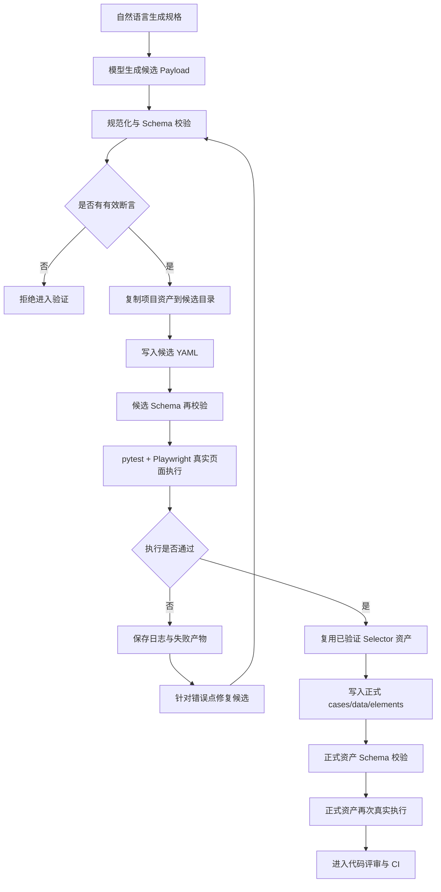

# AI 生成的测试用例，为什么还不能直接进代码库？

最近整理 AI Playwright 的用例生成链路时，我删掉了两个看起来很方便的选项：`--dry-run` 和 `--no-verify`。

现在执行 `gen`，模型生成的 YAML 必须先在真实页面上跑通，才有资格进入正式的 `cases/`、`data/` 和 `elements/` 目录。Schema 合法、字段齐全、代码可以解析，都还不够。

这个限制让生成过程更慢，也让实现多了一层候选目录、执行产物和失败处理。但如果跳过它，代码库很容易收下一批“长得像测试用例”的文件。它们命名规范、结构完整，却可能一次浏览器都没有打开过。

## Schema 只能证明结构合法

AI 很擅长生成结构完整的内容。给它一段业务描述，它可以很快给出测试名称、步骤、元素和断言。

```yaml
# 一个结构合法的候选用例

test_data:
  test_add_product_to_cart:
    mode: smart
    steps:
      - action: click
        target: Sauce Labs Backpack 的加入购物车按钮
      - action: assert_text
        selector: shopping_cart_badge
        value: "1"
```

这段 YAML 可以通过解析和 Schema 校验，但页面不会因此自动回答下面这些问题：

- `target` 能否映射到当前页面里的真实元素？
- 点击后是否发生了预期状态变化？
- 断言检查的是业务结果，还是一个碰巧出现的文本？
- 当前账号、环境和数据是否允许这条路径成立？

Schema 检查资产结构。浏览器验证执行事实。两道门解决的问题不同。

在进入浏览器之前，AI Playwright 还会检查候选用例是否至少包含一项有效断言。下面是从主分支实现中压缩出的核心逻辑。为了便于阅读，省略了类型保护和完整错误信息，但保留了 `data_name`、上下文模块合并与递归断言检查这些关键语义。

```python
# 摘录并压缩自 ai_generation/case_generator.py

def _assert_effective_verification_payload(context, payload):
    modules = dict(context.modules or {})
    modules.update(payload.get("modules") or {})
    data = payload.get("data") or {}

    for case in payload.get("cases") or []:
        case_name = str(case.get("name") or "")
        data_name = str(case.get("data_name") or case_name)
        steps = (data.get(data_name) or {}).get("steps") or []

        if not _steps_have_effective_assertion(steps, modules, seen=set()):
            raise ValueError("生成用例缺少有效信息断言")
```

这只是一道最低准入门。它能排除只有点击、输入和跳转、却没有任何可观察结果的候选用例；它不能证明断言选得足够好，更不能证明需求覆盖完整。

## 候选文件不能和正式资产拥有同样的权威

模型生成 Payload 后，系统不会直接修改正式测试目录。它会复制当前项目上下文，在本次生成产物目录中建立独立候选区。

候选资产依次经过：

1. Harness 规范化；
2. Schema 校验；
3. 有效断言检查；
4. 写入候选 YAML；
5. pytest 与 Playwright 真实页面执行。

候选执行通过后，文件才会写入正式目录；写入后还要再次执行。下面是这段链路的结构化摘录，使用了省略号，不是可以直接运行的完整函数。

```python
# 结构化摘录：展示准入顺序，不可直接运行

def _verify_candidate_persist_formal(...):
    # 1. 最低断言门
    _assert_effective_verification_payload(context, payload)

    # 2. 候选目录写入、Schema 校验和真实页面执行
    _write_and_verify_candidate(...)

    # 3. 候选通过后写入正式目录，并再次执行
    _write_payload(
        result,
        overwrite=overwrite,
        verify=lambda: _validate_written_case_file(result),
        post_verify=lambda: _verify_generated_case(
            context=context,
            env=env,
            result=result,
            stage="正式存储后",
        ),
    )
```

候选文件可以失败、被修复或被丢弃。正式文件会被 pytest 收集，会进入代码评审和 CI，也会影响后续回归。把两者混在一起，相当于让模型输出在获得证据之前就成为权威数据。



*图 1｜候选结果经过断言、Schema、真实执行和正式写入后的二次验证，才进入代码评审与 CI。微信版本使用同目录的 SVG/PNG 导出图。*

## 验证生成结果时，我关闭了运行时 AI 自愈

候选用例执行期间，系统会把 `UI_AI_MODE` 设置为 `strict`。

```python
# 主分支中的实际执行设置

os.environ["UI_AI_MODE"] = "strict"
exit_code = pytest.main(
    _verification_pytest_args(
        case_file,
        browser=browser_name,
    )
)
```

这一步看起来有些反直觉。框架已经支持智能定位和运行时 Agent，为什么不让它们顺手修复生成结果？

因为准入阶段要检查的是准备提交到仓库的资产本身。假设候选步骤引用了错误元素，运行时模型临时猜中了另一个 Selector，执行结果可能是绿的，正式 YAML 里留下的却仍然是错误引用。关闭模型或切换环境后，问题会重新出现。

生成阶段可以使用模型理解自然语言；资产准入阶段需要尽量确定，让同一份 YAML 在不依赖临时推理的情况下完成验证。

这也是测试前移的一种具体实现：验证不是生成结束后的补救任务，它属于生成事务本身。

## 一个自然语言目标，最终要落到稳定的元素键

真实执行还暴露过另一类问题：模型知道用户要点击“登录按钮”，却没有把这段自然语言绑定到项目已有的 `login_button` 元素键。

候选步骤可能只有自然语言目标：

```yaml
- action: click
  target: 登录按钮
```

经过语义匹配后，规范化结果会保留人能读懂的目标，同时补上代码库中的稳定引用：

```yaml
- action: click
  selector: login_button
  target: 登录按钮
```

这项修正在提交 `328222e` 中加入。它解决的不是“模型能不能找到按钮”，而是模型找到之后，能否把结果沉淀成后续测试可以复用和审查的资产。

另一个提交 `98d17f7` 处理了相邻问题：候选执行过程中已经被浏览器验证过的 Selector 修复，即使本轮候选最终失败，也不应该全部丢弃。系统会记录这些更新，并在下一轮修复时复用已经获得的证据。

## 失败需要留下可继续工作的证据

真实页面验证失败时，AI Playwright 会保留本次生成目录、候选文件、pytest 输出、模型 Payload 和错误信息。成功时这些临时产物会清理；失败时它们会留在 `logs/generation_runs/` 下。

模型可以根据具体错误修复候选，但修复后的内容仍要重新走规范化、Schema、断言和浏览器验证。失败不是一句“生成失败”，它至少要回答：

- 失败发生在哪一步；
- 浏览器实际返回了什么；
- 哪些 Selector 已经得到验证；
- 下一轮从哪份候选继续。

没有这些信息，模型每次只能从头猜。生成速度越快，同类错误重复得也越快。

## 浏览器跑通，只代表获得了入场券

一次真实页面通过只能说明：在当前代码、页面、账号和数据条件下，这条路径得到了预期结果。

它不能自动证明需求覆盖完整，也不能证明边界路径没有遗漏。断言可能选择了次要结果，新增用例也可能与既有资产重复。

所以仓库 CI 还会继续执行：

| 质量门 | 主要回答的问题 |
|---|---|
| Python 编译与格式 | 代码能否被稳定读取和维护 |
| 框架契约测试 | 生成与执行规则是否被破坏 |
| YAML Schema | 正式测试资产结构是否合法 |
| 重复定义检查 | 是否写入了冲突或重复资产 |
| pytest 收集 | 正式用例能否被框架识别 |
| 包构建与安装冒烟 | 脱离源码目录后是否仍可使用 |

真实浏览器验证回答“这条路径现在能不能跑”。仓库质量门继续检查“这项变更能不能作为长期资产留下来”。

## 我现在更关心候选如何获得资格

AI 自动化测试最容易展示的是一次生成了多少用例。这个数字直观，也适合做 Demo。

我现在更关注另一组问题：候选是否有明确断言，能否在真实页面执行，失败是否留下证据，验证过的 Selector 能否复用，正式写入后是否还能通过完整 CI。

这条链路比“自然语言直接生成脚本”慢，也多了不少工程工作，但它把模型输出、执行证据和正式资产分开了。

把 AI 接入代码或测试资产生成流程时，可以先检查一个问题：

> 模型输出之后、正式写入之前，系统要求它拿出什么证据？

如果这个阶段没有明确答案，后面的测试大概率只能负责清理已经进入代码库的问题。

## 代码与复现

完整实现和复现命令保存在公开仓库：

- `ai_playwright/cli/generate_case.py`
- `ai_playwright/ai_generation/case_generator.py`
- `.github/workflows/ci.yml`
- `docs/articles/ai-generated-tests-verification-first/reproduce.md`
